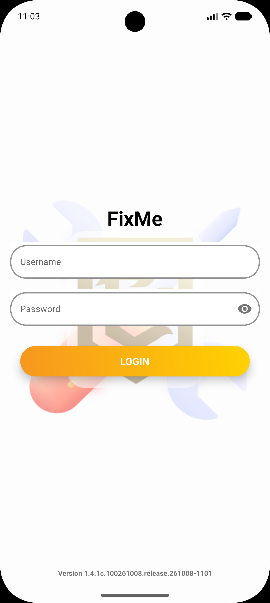
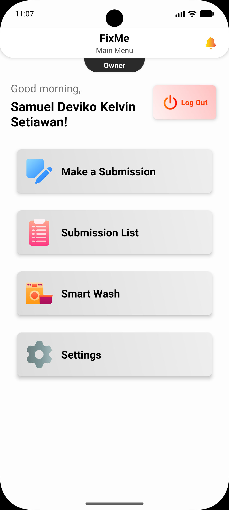

# FIXMe Android

Mobile client for the FIXMe enterprise asset & maintenance management system — PT Erlangga Edi Laboratories (Erela).

The app gives field technicians, supervisors, and managers a full-featured mobile interface for submitting and tracking maintenance cases, managing approvals, logging progress, and running AC preventive maintenance — with real-time notifications via SSE and Pusher.

---

## Screenshots

| Login | Main Menu |
|---|---|
|  |  |

---

## Tech Stack

| Area | Library / Tool |
|---|---|
| Language | Kotlin |
| Min SDK | 26 (Android 8.0) |
| Target / Compile SDK | 37 |
| UI | XML Layouts, Material Design 3, ConstraintLayout, light and dark theme |
| Architecture | Activities, with ViewModel + Repository for the AC and Smart Wash modules |
| Networking | Retrofit 3.0.0 + OkHttp 5.5.0 (with okhttp-sse) |
| Image Loading | Glide 5.0.9 |
| QR Scanning | ZXing Android Embedded 4.3.0 |
| Real-time | Server-Sent Events (SSE), Pusher Java Client 2.4.4 |
| Push Notifications | Firebase Cloud Messaging (Firebase BoM 35.0.0) |
| Printing | ESC/POS over Bluetooth SPP to an 80 mm thermal printer |
| Maps / Location | Google Maps 20.0.0, Play Services Location 21.4.0 |
| Animations | Lottie 6.7.1 |
| In-app Updates | AppXUpdater 2.0.20 |
| Build | Gradle (AGP 9.4.1, bundled Kotlin), JVM target 11 |

---

## Features

### Authentication
- Login with username and password
- Change password and email from Settings
- Session persistence via SharedPreferences

### Case / Submission Management
- Browse submission list with department and status filters
- Submit new maintenance/GA requests (category, department, location, photo)
- View full submission detail with timeline
- Edit, cancel, approve, or reject submissions
- Dual-approval chain: reporting dept manager → target dept manager
- Hold and resume issues

### Progress Tracking
- Add and update progress entries with photos
- Log material usage per progress entry
- Request material additions with approval workflow
- Mark progress as done and hand off to trial

### Trial Management
- Mark submission ready for trial
- Start and report trial results

### Technician & Supervisor Assignment
- Set and update SPV (supervisor) and field technicians per case

### AC Maintenance Module
- Scan AC unit QR code to start a maintenance session
- Check in / check out for maintenance tasks
- View task list for the current session
- Manage session participants (add/remove technicians)

### Smart Wash — Uniform Laundry
- Hand uniforms in by scanning the laundry counter QR code
- Scan each garment patch into the delivery, then follow the batch: accepted, being washed,
  ready to collect
- Collect by scanning the counter QR again
- For counter staff: verify a delivery and accept or reject it, record each garment's condition
  before and after washing, mark a batch ready, and print the slip on a Bluetooth thermal printer
- Titipan: a garment that arrived mixed in with another department's delivery gets its own tab and
  is handed back to a named collector
- Smart Wash notifications open the matching screen rather than the main menu

### Notifications
- Inbox with all system notifications
- Real-time updates via foreground SSE service
- Firebase Cloud Messaging (configured)

### Settings
- Change password
- Change email
- Dark mode, under Appearance — per device, kept across updates
- App version info and in-app update check

---

## Architecture

```
app/src/main/java/com/erela/fixme/
├── activities/         # 18 screens (one Activity per screen), 4 of them Smart Wash
├── adapters/
│   ├── recycler_view/  # RecyclerView adapters for lists
│   └── pager/          # ViewPager adapters
├── bottom_sheets/      # 18 Material bottom sheets
├── custom_views/       # CustomToast, ActivityContainer, SignaturePadView, zoom helper
├── dialogs/            # Confirmation, Input, OptionList, SignaturePad, Changelog, UpdateAvailable, ...
├── helpers/
│   ├── api/
│   │   ├── GetEndpoint.kt      # Retrofit interface (76 endpoints)
│   │   └── InitAPI.kt          # OkHttpClient + Retrofit setup
│   ├── ThermalPrinter.kt       # Bluetooth slip printer, and in-app printer pairing
│   ├── ThemeHelper.kt          # Light / dark theme
│   ├── UserDataHelper.kt       # SharedPreferences session manager
│   ├── PermissionHelper.kt     # Runtime permissions
│   └── NotificationsHelper.kt  # Local notification builder
├── objects/            # Response & data model classes
│   ├── ac/             # AC models
│   └── laundry/        # Smart Wash models
├── repository/         # AcRepository, LaundryRepository
├── services/
│   ├── SseService.kt           # Foreground SSE real-time service
│   └── FCMService.kt           # FCM message handler
└── viewmodel/          # AcMaintenanceViewModel, LaundryCheckInViewModel
```

---

## API

The app communicates with the [FIXMe Laravel backend][web-gh] via a REST API at:

```
{BASE_URL}apimobile/
```

| Group | Endpoints |
|---|---|
| Auth | login, logout, session, changePassword, changeEmail, updateFcmToken |
| Submissions | reportList, reportDetail, submitReport, reportUpdate, cancelReport, approve (reporter / target manager), statusReject, statusHold, statusResume, markIssueAsDone |
| Progress | getProgress, submitProgress, updateProgress, updateProgressMaterial, deleteProgress, progressDone |
| Materials | getMaterialList, requestMaterialAdd, approveMaterialRequest |
| Assignments | getSpv, getTechnician, updateAssignedSpv, setupTechnician, updateAssignedTech |
| Categories / Depts | getCategoryList, getDepartmentList, getTargetDepartment, getTargetSubDept, updateCategoryComplexity |
| Trial | markReadyForTrial, getTrial, startTrial, reportTrial |
| AC Maintenance | acScan, acCheckIn, acCheckOut, acTaskList, acAddTechnician, acRemoveTechnician, acGetTechnicians, acSessionParticipants |
| Smart Wash | laundryArrive, laundryAddItems, laundryMyBatches, laundryBatch, laundryCollect, the counter queues, laundryVerify, laundryAccept, laundryReject, laundryWashStart, laundryConditionOut, laundryReady, laundryHandoverMark, laundrySlip, laundryScan, held items and pickup |
| Notifications | checkInbox |
| Updates | checkUpdate |

76 endpoints in `GetEndpoint.kt`. Every message the server returns is bilingual; the app's `lang` field
picks English or Indonesian. Base URLs are set per build type in `app/build.gradle` (see Build Setup).

---

## Requirements

- Android Studio with AGP 9.4 support
- JDK 11+
- Android device or emulator running **Android 8.0+ (API 26)**
- `local.properties` configured (see below)
- Access to the FIXMe backend server
- For slip printing: an 80 mm ESC/POS Bluetooth printer (Bluetooth Classic, not BLE)

---

## Build Setup

### 1. Clone the repository

```bash
git clone <repository-url>
cd FixMe-android
```

### 2. Configure `local.properties`

Create or edit `local.properties` in the project root (it is gitignored):

```properties
sdk.dir=/path/to/your/Android/sdk

MAPS_API_KEY=your_google_maps_api_key

# Optional: your own dev server for debug builds. Without it, debug builds use the office server.
DEBUG_BASE_URL=http://192.168.x.x/fixme/

# Release signing (only needed for release builds)
KEYSTORE_STORE_PASSWORD=
KEYSTORE_KEY_ALIAS=
KEYSTORE_KEY_PASSWORD=
```

### 3. Configure `google-services.json`

Place your Firebase `google-services.json` in `app/`.

### 4. Build & Run

The build has an update **channel** flavor as well as a build type, so task names carry both:

```bash
# Debug build, stable channel
./gradlew assembleStableDebug

# Release build, stable channel
./gradlew assembleStableRelease
```

A bare `./gradlew assembleDebug` builds every channel. In Android Studio, pick a variant in the
Build Variants panel.

### Update channels

All four channels share one application ID, so an installed app can move up a channel by installing
a newer channel's APK. Moving back down needs a reinstall.

| Flavor | Channel | Purpose |
|---|---|---|
| `stable` | release | What users run |
| `beta` | beta prerelease | Wider testing before stable |
| `dev` | dev | Internal builds |
| `canary` | canary | Newest, least stable |

### Build types

| Type | Base URL | Notes |
|---|---|---|
| `debug` | `DEBUG_BASE_URL` from `local.properties`, else the office dev server | Debuggable, no minification |
| `release` | `http://182.23.21.202:8282/fixme/` | Production server, minified + ProGuard |

### Tests

```bash
./gradlew testStableDebugUnitTest                                   # unit tests
./gradlew connectedStableDebugAndroidTest                           # instrumented, debug build
./gradlew connectedStableDebugAndroidTest -PtestBuildType=release   # instrumented, release build
```

Connected tasks run on **every** attached device and uninstall the app afterwards, so disconnect any
device you do not want touched.

---

## Permissions

| Permission | Purpose |
|---|---|
| `INTERNET` | API and real-time communication |
| `CAMERA` | QR code scanning, photo capture |
| `ACCESS_FINE_LOCATION` / `ACCESS_COARSE_LOCATION` | Location tagging on submissions |
| `READ_MEDIA_IMAGES` / `READ_MEDIA_VIDEO` / `READ_MEDIA_VISUAL_USER_SELECTED` | Photo attachment on Android 13+ |
| `READ_EXTERNAL_STORAGE` / `WRITE_EXTERNAL_STORAGE` | Photo attachment on older Android |
| `POST_NOTIFICATIONS` | Push notification display |
| `FOREGROUND_SERVICE` / `FOREGROUND_SERVICE_DATA_SYNC` | SSE real-time background service |
| `BLUETOOTH_CONNECT` | Smart Wash slip printer (Android 12+), declared `neverForLocation` |
| `BLUETOOTH` / `BLUETOOTH_ADMIN` | The same, on Android 11 and below |
| `REQUEST_INSTALL_PACKAGES` / `SEND_DOWNLOAD_COMPLETED_INTENTS` | In-app APK update download and install |

The optional `android.software.companion_device_setup` feature lets the app pair a printer through the
system chooser, without `BLUETOOTH_SCAN` or location access.

---

## Version

Current version: **1.4.1c** (build auto-incremented via `buildNumber.properties`)

---

## Related Repositories

Every repository is published to both hosts, and one Markdown link can only name one of them, so
each row carries the pair. The URLs are reference-style and collected under the table: one place to
keep right rather than six scattered through the file.

| | GitHub | GitLab |
|---|---|---|
| Web (Laravel) | [FixMe-Laravel][web-gh] | [fixme/fixme-laravel][web-gl] |
| Mobile (Compose) | [FixMe-Android-Compose][compose-gh] | [fixme/fixme-android-compose][compose-gl] |

[web-gh]: https://github.com/PT-Erlangga-Edi-Laboratories-Erela/FixMe-Laravel
[web-gl]: https://gitlab.erela.co.id/fixme/fixme-laravel
[compose-gh]: https://github.com/DevikoKelvin/FixMe-Android-Compose
[compose-gl]: https://gitlab.erela.co.id/fixme/fixme-android-compose

---

## License

Proprietary — PT Erlangga Edi Laboratories. All rights reserved.
